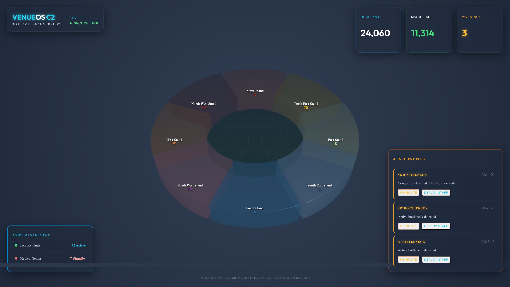

# VenueOS C2



VenueOS C2 (Command & Control) is the operating system for physical venues. Just like Android or Windows manages apps, resources, and user interactions—VenueOS manages people, movement, and real-time decisions inside a venue. Not just dashboards. Not just alerts. Control. Coordination. Optimization.

Designed to handle large-scale sporting events with high architectural limits, VenueOS C2 actively targets crowd telemetry, localized mathematical density congestion, long queues, and precise topological metrics.

## ✨ Features

- **Real-Time Crowd Telemetry**: High-throughput ingestion of turnstile access pulses and raw spatial density data tracking exact global limits (SPACE LEFT algorithms).
- **Intelligent Alerting via Hysteresis**: Stateful congestion alerts that prevent "flapping." Real-time dynamic scaling tracks raw populations and generates `alert.crowd` incidents safely.
- **Queue Prediction (M/M/1 Modeling)**: Calculates live expected wait times at points of interest (food stalls, restrooms) based on arrival ($\lambda$) and service ($\mu$) rates.
- **Resilient Notification Governor**: Outbound coordination messages are rate-limited, guarded by Circuit Breakers (`opossum`), and tuned by a "Compliance Decay" projection to prevent user fatigue.
- **High-Fidelity Operator Dashboard (C2)**: A real-time, interactive UI showcasing a meticulously crafted `three.js` light-dark stadium model, interactive popup management panes, and synchronized WebSocket feed alerts.
- **Self-Healing Infrastructure**: In-memory EventBus with built-in backpressure, automated missing-data interpolation, and a Redis-backed Dead Letter Queue (DLQ).

## 🏗️ Architecture

VenueOS is built using a decoupled, event-driven architecture for maximum resilience and throughput.

```text
[ Turnstiles / Cameras / App ] 
            |
            v
[ Crowd Ingestion Svc ] --(Normalization / Interpolation)--> [ EventBus ]
                                                                 |
                                +--------------------------------+--------------------------------+
                                |                                                                 |
                                v                                                                 v
                    [ Crowd Processing Engine ]                                      [ Queue Prediction Svc ]
                    (Occupancy & Hysteresis)                                              (M/M/1 Model)
                                |                                                                 |
                                +--------------------------------+--------------------------------+
                                                                 |
                                                                 v
                                                     [ Dashboard API / WS ]  <---- [ API Gateway (Rate Limiting) ]
                                                                 |                                ^
                                                                 v                                |
                                                    [ Operator Dashboard UI ] --------------------+
```

## 🚀 Getting Started

### Prerequisites
- **Node.js** (v20+ recommended)
- **Redis** running locally (default: `redis://localhost:6379`)

### Installation & Execution

1. **Start Redis** (if not already running):
   ```bash
   # Example using Docker
   docker run -d -p 6379:6379 redis
   ```

2. **Install Dependencies**:
   ```bash
   npm install
   cd frontend && npm install && cd ..
   ```

3. **Start the System**:
   ```bash
   npm start
   ```
   *This single command leverages `concurrently` to spin up the Backend, the built-in Halftime Simulation Engine, the API Gateway, and the Vite-powered Operator Dashboard.*

4. **Access the Dashboard**:
   Open [http://localhost:5173](http://localhost:5173) in your browser.

## 🧪 Halftime Simulation

VenueOS includes an automated stress-testing engine that simulates a 50k attendee load. When you run `npm start`, the simulation progresses through phases:

1. **T=0s**: Normal entry traffic. Venue occupancy climbs steadily.
2. **T=10s**: **Halftime Rush Triggered**.
   - Massive exit pulses are simulated.
   - Sudden density spikes occur in specific zones (e.g., Concessions).
   - You will see the Heatmap turn red, and congestion alerts will populate the Incident Feed.
3. **T=30s**: **Recovery Phase**. Halftime concludes, and alerts clear intelligently using the Hysteresis parameters.
4. **Periodic**: The simulation routinely injects malformed events to verify the Dead Letter Queue routing.

## 🛠️ The Science Under the Hood

### 1. Zone-Aware Reachability (Phantom Load)
Not all attendees have the venue app. VenueOS applies a dynamic multiplier to sensed data based on zone context (e.g., Gates: 1.8x, Concourse: 1.5x) to estimate true crowd density accurately.

### 2. M/M/1 Queuing Theory
Wait times are modeled mathematically.
- $W = 1 / (\mu - \lambda)$
- If the queue becomes unstable (Arrival Rate $\ge$ Service Rate), the system falls back to a heuristic: `CurrentLength * AvgServiceTime`.

### 3. Compliance Decay Curve
To prevent spamming users after issuing a crowd diversion:
- $P(t) = D_{init} \cdot (1 - (R_{zone} \cdot C_{base} \cdot e^{-\lambda t}))$
- Alerts are temporarily suppressed based on an exponential decay curve projecting when density will naturally fall.

## 💻 Tech Stack
- **Backend**: TypeScript, Node.js, Express, `ws` (WebSockets), `ioredis`, `pino` (Structured Logging), `opossum` (Circuit Breakers).
- **Frontend**: Vite, TypeScript, HTML5 Canvas, Vanilla CSS (Glassmorphism design).
